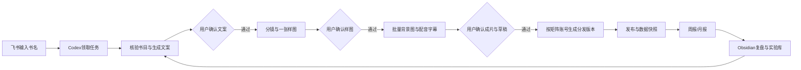

# 飞书 × Codex × Obsidian 图书视频矩阵生产线

## 1. 三个系统的职责

- 飞书多维表格：唯一运营控制台。负责输入、状态、确认、账号、分发、数据和复盘任务。
- Codex：生产执行器。读取飞书任务，调用图书视频生产 skill，写入本地工作目录并回写结果。
- Obsidian：长期知识库。保存周报、月报、实验结论和可复用方法，不保存实时任务锁或账号凭证。



## 2. 新书自动触发规则

在 `图书项目` 新增一行时，只填 `书名` 即可。

Codex 轮询器只领取同时满足以下条件的记录：

1. `书名` 非空；
2. `项目ID` 为空；
3. `Codex状态` 为空或为 `待领取`；
4. `执行指令` 不是 `暂停` 或 `取消`。

领取时一次性回写：`项目ID`、`Codex状态=执行中`、`Codex运行ID`、`Codex最近心跳`。运行 ID 是防止重复执行的任务锁。

默认 `生产模式=标准全流程`，自动完成书目核验和文案初稿，然后必须停在 `文案确认`。后续每个用户门禁通过后才继续执行下一个阶段。

## 3. 自动化状态机

| 当前门禁 | Codex 自动动作 | 产物 | 何时停止 |
| --- | --- | --- | --- |
| 新书接入 | 核验书名、作者、版本和引用来源 | `script_sources.md` | 书目信息存在歧义 |
| 文案审核 | 生成并自检原创口播稿 | `script.txt` | 等待用户确认文案 |
| 风格样图审核 | 生成分镜草案和 1 张样图 | `storyboard.json`、样图 | 等待用户确认画风 |
| 背景图与分镜审核 | 批量生成背景图并检查语义与连续性 | `storyboard/images/` | 等待用户确认画面 |
| 配音与字幕制作 | 锁定男声、双语单行字幕、真实时长 | `voice/`、SRT | 质检失败或前置门禁未通过 |
| 成片与草稿审核 | 固定开头、混音、成片、全新剪映草稿 | MP4、草稿、质检报告 | 等待用户审片 |
| 发布确认 | 生成账号适配标题、钩子、封面和发布文案 | `内容分发` 记录 | 不自动登录或发布 |
| 发布结果与归档 | 回收链接和数据，用户批准后归档 | `final/`、数据快照 | 未明确批准归档 |

## 4. 飞书数据模型

### 4.1 核心生产

- `图书项目`：一本书一个母版项目，也是新任务入口。
- `确认节点`：一个项目对应 8 个门禁。
- `Codex任务队列`：记录领取、心跳、重试、错误和输出，不让任务静默失败。
- `公共资产`：固定开头、背景音乐、锁定男声预设与金标准。
- `状态字典`：阶段顺序和出口条件。

### 4.2 矩阵运营

- `矩阵账号`：一个账号一行，保存定位、受众、内容支柱、周更目标和采集方式。
- `内容分发`：母版内容 × 账号形成一条分发记录。同一视频发 5 个账号就有 5 条记录。
- `发布记录`：平台作品链接、实际发布日期和发布后质检。
- `数据快照`：同一作品在 24 小时、72 小时、7 天、30 天分别留一条快照，禁止覆盖历史值。
- `复盘记录`：单条内容、账号周报、矩阵周报、产品月报和实验复盘。

## 5. 账号矩阵的管理原则

账号至少要填写：`账号ID`、`账号名称`、`平台`、`矩阵分组`、`账号定位`、`目标受众`、`内容支柱`、`周更目标`、`发布方式`、`数据采集方式`。

不要在飞书保存密码、Cookie、短信验证码或二次验证信息。`凭证别名` 只记录安全存储位置的别名，例如 `wechat-channel-main-01`。

建议先按产品和受众分组，而不是按账号名称分组：

- 产品线：图书视频；
- 受众线：职场成长、情绪疗愈、亲子教育、传统文化等；
- 内容角色：主账号、垂类实验号、封面/钩子测试号、复投号。

## 6. 数据回收与指标

首期采用 `手工录入 / Excel 导入 / 截图识别`。未来若获得可靠的官方或第三方接口，再将 `数据来源` 切换为 API。

建议快照节奏：发布后 24 小时、72 小时、7 天、30 天。

核心计算口径：

- 互动率 =（点赞 + 评论 + 转发 + 收藏）/ 播放量；
- 关注转化率 = 新增关注 / 独立观众；没有独立观众时暂用播放量并标注口径；
- 分享率 = 转发 / 播放量；
- 收藏率 = 收藏 / 播放量；
- 线索转化率 = 私信线索 / 主页访问；
- 商业转化率 = 成交单量 / 私信线索。

不要只比较累计播放量。至少同时比较：账号定位、书籍主题、开头钩子、视频时长、发布时间、封面版本、完播率、互动率和关注转化率。

## 7. Obsidian 复盘结构

实际写入前需要配置环境变量 `OBSIDIAN_VAULT_PATH`。建议目录：

```text
运营复盘/图书视频生产线/
  00-生产线总览.md
  索引.md
  账号/
    ACC-001-账号名.md
  内容/
    2026/
      2026-07-20-书名-CONTENT-ID.md
  周报/
    2026-W30-矩阵周报.md
  月报/
    2026-07-产品月报.md
  实验库/
    EXP-202607-001-开头钩子实验.md
```

每份复盘包含：来源时间、飞书对象 ID、查重结论、数据口径、最佳/低表现内容、有效规律、反例、下一轮假设、实验设计、停止条件和回写结果。

Codex 写入 Obsidian 后，将文件路径回写到 `复盘记录.Obsidian路径` 和 `图书项目.Obsidian复盘路径`，防止重复生成。

## 8. 建议的 Codex 自动任务

### 任务 A：生产任务接管

- 建议频率：每 10 分钟；
- 查找新书或 `执行指令=继续执行/重试` 的记录；
- 一次只领取一个任务；
- 每个用户确认门禁必须停止；
- 失败时写入 `Codex错误信息` 和 `任务异常` 视图。

### 任务 B：数据回收

- 建议频率：每天两次；
- 查找已发布且到达 24h/72h/7d/30d 节点的分发记录；
- 首期只提醒导入或上传截图；有稳定接口后再自动采集。

### 任务 C：复盘与 Obsidian 同步

- 建议频率：每周一生成上周矩阵周报；每月 1 日生成上月产品月报；
- 只读取已经冻结的数据快照；
- 先在飞书生成 `待确认` 复盘记录；
- 用户确认后写入 Obsidian，并把结论转成下一轮实验。

## 9. 启用前仍需补充

1. Obsidian vault 的绝对路径；
2. 第一批矩阵账号的账号 ID、名称、定位和分组；
3. 数据采集首期选择：手工、Excel 还是截图；
4. Codex 轮询频率是否采用每 10 分钟；
5. 是否只生成到审核样片，保持人工发布（推荐）。
